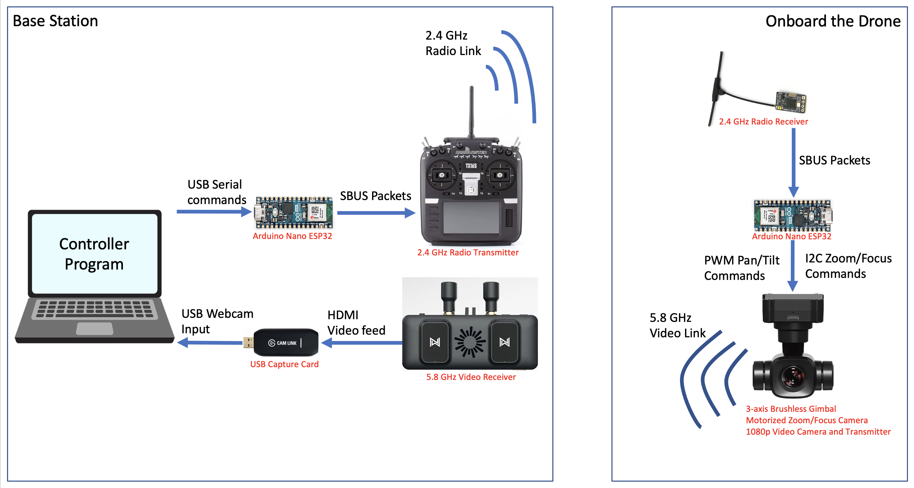
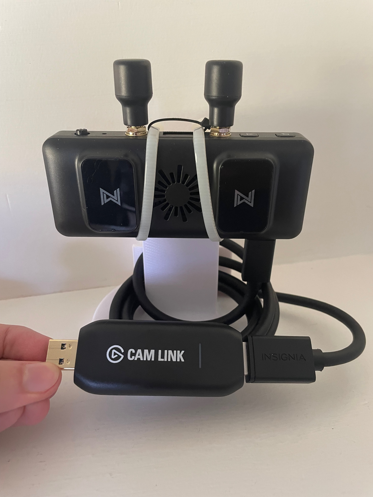
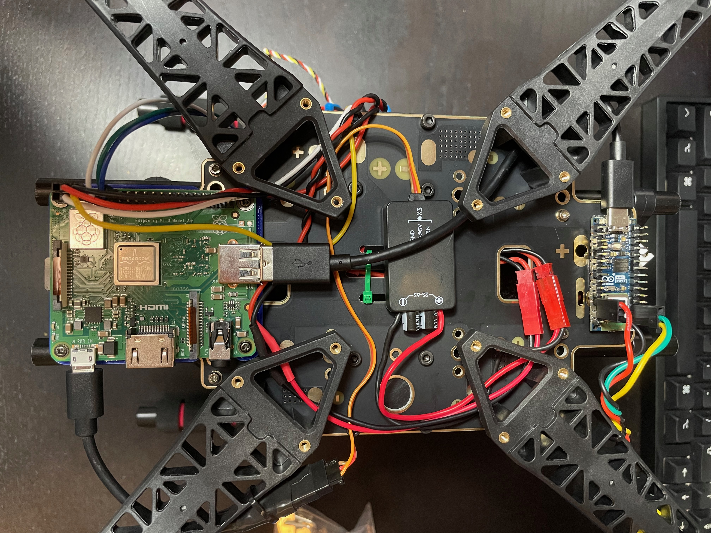

# A DIY Drone Computer Vision Development Platform

https://github.com/benjilwhite/CVDrone/assets/80803128/c2de09a2-331a-40f0-a45e-6ba09113383a

The goal of this project is to create a relatively inexpensive camera platform that can be mounted on a drone, transmit a 1080p video feed, and remotely control pan, tilt, and optical zoom. An interface to this will make it simple to develop computer vision applications that require camera movements.

## Wiring/Communication Diagram

Here's the current layout of the system.

### Hardware Components

##### Video Feed
For video I'm using the [Walksnail Avatar HD FPV video system.](https://www.racedayquads.com/products/walksnail-avatar-vrx-combo-choose-version?variant=40051916701809) It's designed for low-latency FPV quadcopters, and can transmit a 1080p 60fps video feed back to a base station. The link has favorable qualities for this application, with the manufacturer claiming a range of around 2.5 miles, but some online have been able to achieve greater ranges than that.

##### Camera Setup
The only issue with this system in this case is that the camera features an extremely wide-angle lens. Such a lens is optimal for flying an FPV drone, but I wanted a more flexible camera that could zoom in/out and still have detail. Ideally the camera could be replaced, but the link between the camera sensor and the video transmitter appears to be a proprietary protocol on some sort of coaxial cable, which I don't have the expertise to reverse-engineer. However, the camera lens is easily removed, and the micro camera version has a 1/2.7" sensor.

  

The solution was to attach the sensor to a larger lens which would allow for remote zoom and focus. I settled on one of these [Raspberry Pi Pan/Tilt/Zoom camera lenses](https://www.uctronics.com/arducam-ptz-pan-tilt-zoom-camera-for-raspberry-pi.html), which are designed for a 1/2.7" sensor, and have servo motors to control zoom and focus from a Raspberry Pi. I used a 3D printed mount to align the sensor and lens in a robust fashion.

##### Base Station

  

The Walksnail Avatar video receiver outputs an HDMI signal, which I'm converting into a webcam feed using an [Elgato Cam Link](https://www.elgato.com/us/en/p/cam-link-4k). This allows any computer vision application to easily get a video feed and treat it as a normal webcam.

#### Electronics and Control

The electronics setup is currently overcomplicated for what it does, and I'm working on developing a simpler system that reduces the amount of communication required between devices. More to come in the future.

##### Control Link

To control the camera I'm using an ExpressLRS controller and receiver.
